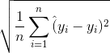

# nyc_taxi

## Project Description

The goal of our project is to estimate the price of New York Taxi fare. We are given a training data set of 55 million rows. We will create various models that attempt to estimate the target variable, and the metric we will use to evaluate the quality of our model will be the root mean square error:

This project follows the framework provided by a Kaggle competition from Google Cloud (https://www.kaggle.com/c/new-york-city-taxi-fare-prediction).

## Contents of Repository

[taxiFare.20190312_final_copy.ipynb](taxiFare.20190312_final_copy.ipynb): Main jupyter notebook with our analysis . 
[img](img/): Folder with supplementary images  
[archive](archive/): Folder with previous versions of jupyter notebook with our analysis . 

## Project Structure

The project includes:  

1. Initial loading and cleaning of data
2. Feature Engineering
3. Exploratory Data Analysis
4. Model Exploration
* Elastic net
* XG Boost
* K-nearest Neighbor Regression

